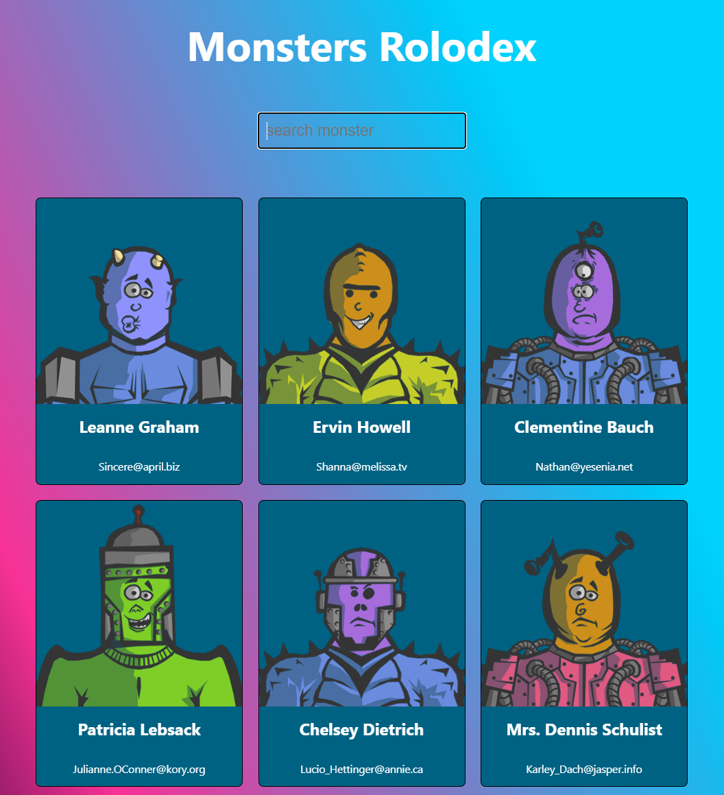
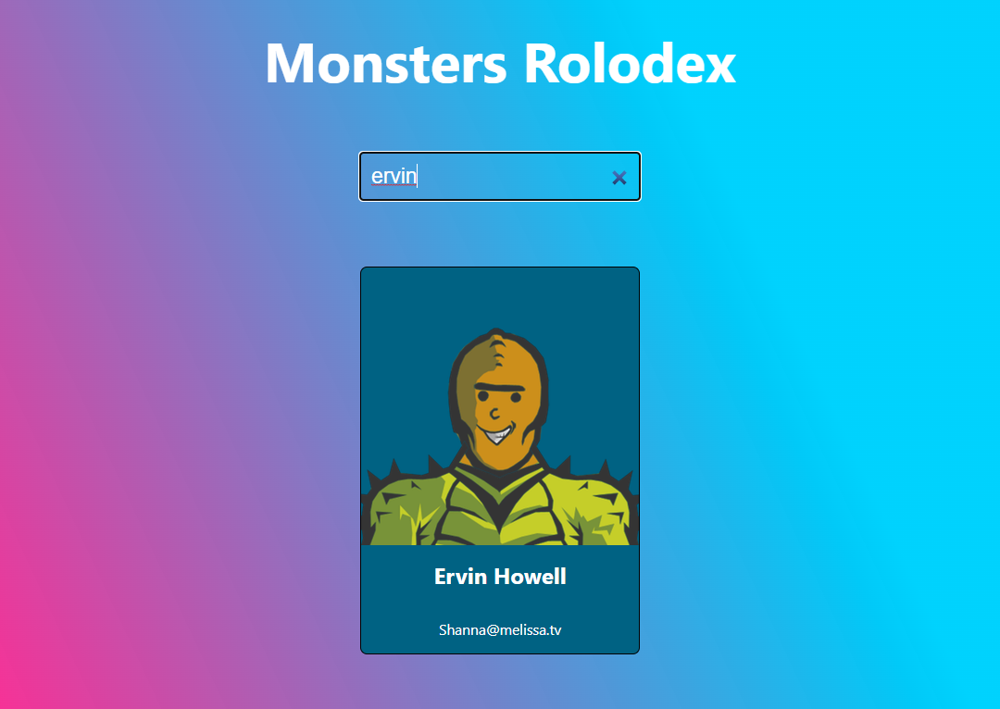

# Monsters Rolodex

Monster Rolodex React App - A fun and educational tool for learning React.

This app was developed with the intention to learn React and its concepts.
The Monster Rolodex is a simple yet effective way to dive into the world of React and understand
how it works. The app displays a list of monsters, which can be filtered by name or search by typing
into a search bar. The user interface is user-friendly and easy to use, making it the perfect tool for
developers who are just starting to learn React.

The app uses modern React practices, including hooks and functional components,
making it an up-to-date learning resource.

Whether you are an experienced developer looking to expand your knowledge or a beginner just starting out,
this Monster Rolodex React App is an excellent resource for learning and understanding React.

